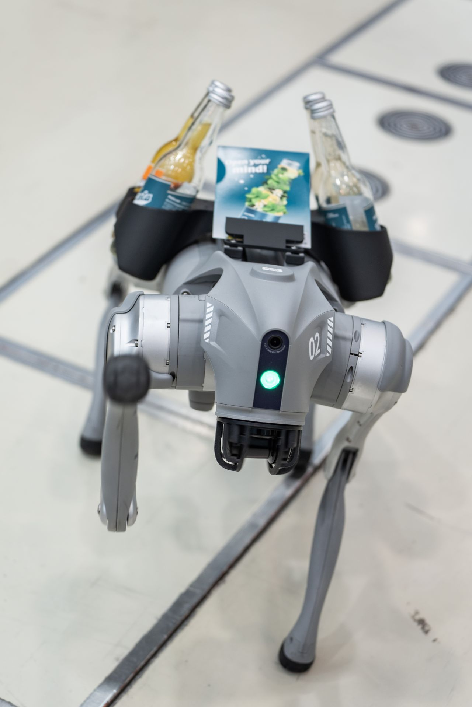
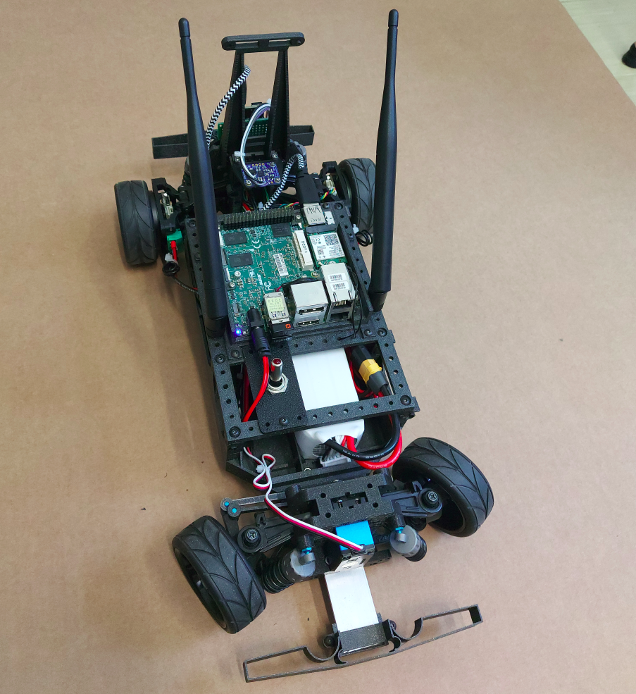
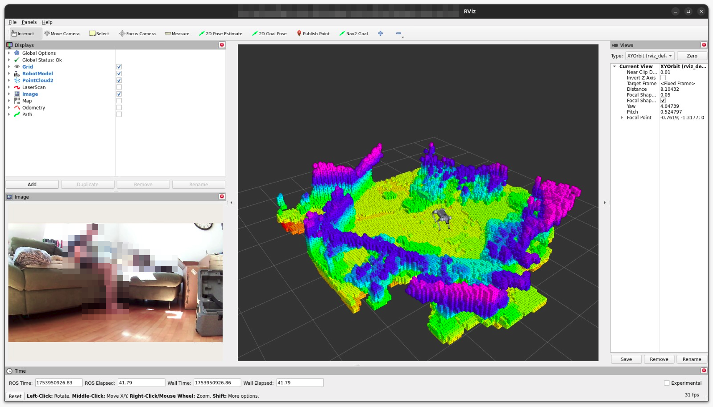

# Hello There Fellow Person
Here are some of my robots in no particular order:

  
  <!--  -->
  
  
  

If you got any questions, write to me on [LinkedIn](https://www.linkedin.com/in/jakob-friedl-roboost/) :)